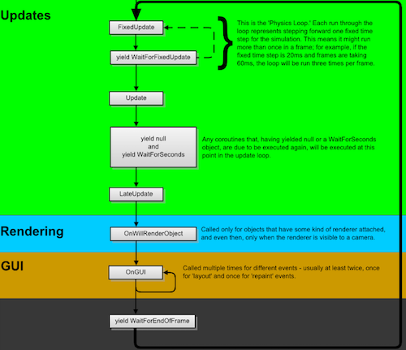

# 04 - More Efficient Yield Statements

When looking at Coroutine code online, one often sees something like

```C#
private IEnumerator DoSomethingEveryFrame()
{
  while(shouldDoSomething)
  {
    //do something
    yield return new WaitForEndOfFrame();
  }
}

private IEnumerator DoSomethingAfterTime(float seconds)
{
  yield return new WaitForSeconds(seconds);
  //do something
}
```

Unbeknownst to many people, every instantiation of a new *WaitForSeconds* or *WaitForEndOfFrame* creates new objects of size ~20 bytes which must be subsequently removed by the garbage collector. As the garbage collector can collect garbage at any point, potentially resulting in a CPU spike and dropped frames, it is imperative to reduce garbage as much as possible.

## Null, WaitForFixedUpdate, WaitForEndOfFrame

Consider the following update cycle (photo courtesy of [Wang Xuanyi](http://www.programering.com/a/MTN5gzMwATg.html)):



If one simply wants to run a block of code on the next frame, and it is irrelevant when this code will run, then **yield return null** is a good solution as no object needs to be created, resulting in roughly 9 bytes of garbage. Instead, if code must be ran in either the fixed update cycle, or at the end of the frame after all processing has occurred, then references to static *WaitForFixedUpdate* and *WaitForEndOfFrame* variables results in the creation of these variables only once, yet they can be used multiple times, even concurrently.

```C#
/// <summary>A backing variable for FixedUpdate.</summary>
static WaitForFixedUpdate _FixedUpdate;
/// <summary>Waits until next fixed frame rate update function.</summary>
public static WaitForFixedUpdate FixedUpdate
{
  get{ return _FixedUpdate ?? (_FixedUpdate = new WaitForFixedUpdate()); }
}

/// <summary>A backing variable for EndOfFrame.</summary>
private static WaitForEndOfFrame _EndOfFrame;
/// <summary>Waits until the end of the frame after all cameras and GUI is rendered, just before displaying the frame on screen.</summary>
public static WaitForEndOfFrame EndOfFrame
{
  get{ return _EndOfFrame ?? (_EndOfFrame = new WaitForEndOfFrame()); }
}
```

## WaitForSeconds

*WaitForSeconds* objects can be cached in a dictionary, whose keys is the wait time itself:

```C#
/// <summary>A dictionary of WaitForSeconds whose keys are the wait time.</summary>
private static Dictionary<float, WaitForSeconds> waitForSecondsDictionary = new Dictionary<float, WaitForSeconds>();
/// <summary>Suspends the coroutine execution for the given amount of seconds using scaled time.</summary>
public static WaitForSeconds Seconds(float seconds)
{
  //test if a WaitForSeconds with this wait time exists - if not, create one
  WaitForSeconds waitForSeconds;
  if(!waitForSecondsDictionary.TryGetValue(seconds, out waitForSeconds))
  {
    waitForSecondsDictionary.Add(seconds, waitForSeconds = new WaitForSeconds(seconds));
  }
  return waitForSeconds;
}
```

By supplying a custom float comparer, we can avoid the values being boxed, inadvertently creating some garbage.

```C#
/// <summary>A Float comparer used in the waitForSecondsDictionary.</summary>
private class FloatComparer : IEqualityComparer<float>
{
  bool IEqualityComparer<float>.Equals(float x, float y) { return x == y; }
  int IEqualityComparer<float>.GetHashCode(float obj) { return obj.GetHashCode(); }
}
/// <summary>A dictionary of WaitForSeconds whose keys are the wait time.</summary>
private static Dictionary<float, WaitForSeconds> waitForSecondsDictionary = new Dictionary<float, WaitForSeconds>(0, new FloatComparer());
```

## Summary

By utilizing null in yield return statements when possible, and caching WaitForFixedFrame, WaitForSeconds and WaitForEndOfFrame variables, we can reduce the number of allocated objects, and help reduce the frequency of collected garbage.

## Further Reading

[C# Coroutine WaitForSeconds Garbage Collection tip](https://forum.unity.com/threads/c-coroutine-waitforseconds-garbage-collection-tip.224878/)

[Boxing and Unboxing](https://docs.microsoft.com/en-us/dotnet/csharp/programming-guide/types/boxing-and-unboxing)