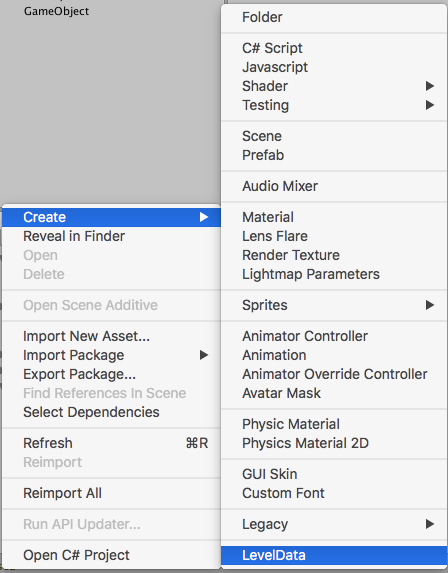

# 08 - Scriptable Objects

A [*ScriptableObject*](https://docs.unity3d.com/ScriptReference/ScriptableObject.html) is a data container which
- has similar functionality to MonoBehaviour but cannot be attached to a GameObject
- supports Serialization and can be saved as an asset in the Unity project
   - can be loaded on runtime but not saved => not suitable for saving a game state
   - serialization/deserialization is built in and fully functional, unlike JSON, XML
- persists settings changed during editor play mode to disk
- optimizes the loading of data, by loading it only when needed

Scriptable objects are very useful when one wishes to vary certain parameters during gameplay (e.g. level variables by the Game Designer) within Unity and persist those changes. So today lets consider that there's a game scene which is repurposed for many different levels. Each level would have it's own index, number of lives, certain enemies etc.

```C#
public class LevelData : ScriptableObject
{
  public int levelIndex;
  public int numberOfPlayerLives;
  public bool isTimed;
  public float timeLimit;
}
```

To turn this scriptable object into an asset, we could write our own editor script (see the **ManualCreateMenuItem** subfolder) or simply place a [*CreateAssetMenu*](https://docs.unity3d.com/ScriptReference/CreateAssetMenuAttribute.html) attribute above our class declaration:

```
[CreateAssetMenu(fileName = "New LevelData", menuName = "LevelData", order = 1000)]
```

which adds the menu item LevelData to the create menu.



I don't fully understand *order* but from what I've tested, 1 is up top, 100 is above *Scene* and 1000 is below *Legacy*.

With our GameManager class containing a reference to a LevelData object,

```C#
public class GameManager : MonoBehaviour
{
  [SerializeField] private LevelData level;
  [SerializeField] private Text numberOfLivesText;

  private void Start()
  {
    //set up for level.levelIndex
    numberOfLivesText.text = level.numberOfPlayerLives.ToString();
  }

  private void Update()
  {
    if(level.isTimed)
    {
      //update timer
    }
  }
}
```

we can now tweak LevelData in the editor during play mode, and our settings will persist. Moreover, this is a workflow which is user friendly for non-programmers: yes, one could edit variables in an XML file but that is error prone and teadious.

Scriptable objects are something I imagine that I'll start to rely more and more on, and as stored databases within the assets they are a solid design choice.

For more information check out this [live training tutorial](https://unity3d.com/learn/tutorials/modules/beginner/live-training-archive/scriptable-objects) from Unity, or this [Saving Game Data](https://www.youtube.com/watch?v=ItZbTYO0Mnw) tutorial. Here is an [interesting script](https://gist.github.com/PachowStudios/2be3d01df2edcdf69116) by [Ryan Shea](https://github.com/PachowStudios) in which one can right click on any inspector field that accepts a *ScriptableObject* to automatically create an asset and assign it to that field.