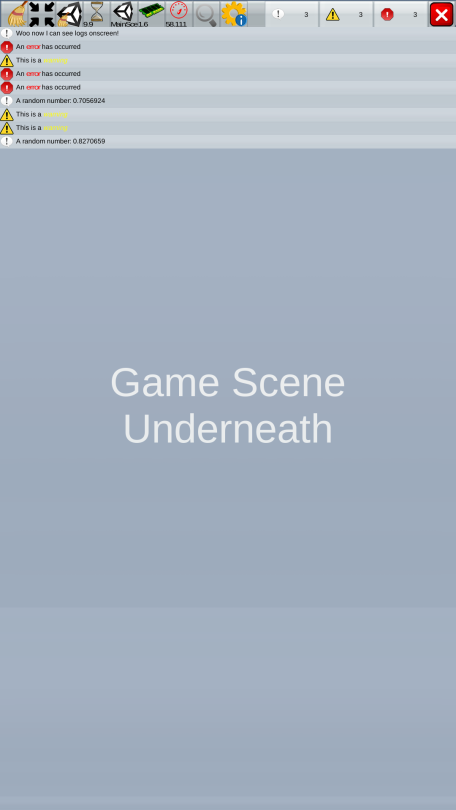

# 11 - On Screen Log Messages

Today’s tip is short and sweet but extremely useful for mobile devices: on screen log messages.

[*Log viewer*](https://www.assetstore.unity3d.com/en/#!/content/12047) is a free asset which builds a overlay window of log messages, accessible by making a circle touch gesture. This window is a copy of the editor console and even supports [Rich Text](https://github.com/defuncart/unity-tips-tricks/tree/master/%2302-RichText).

Whether debugging incorrect logic or catching bugs and crashing from in team testing, I have found this simple asset to be indispensable for mobile development.