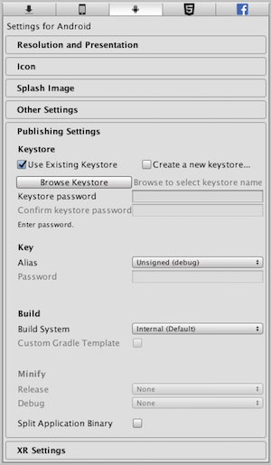

# 12 - Preloading Mobile Signing

To publish on Google Play, one needs to sign their app with a keystone signature file. Various aliases (i.e. users) can be authorized to use this file, each with their own password. In the Android Publishing section, we can select the keystone and alias, and enter their respective passwords.



Eachtime that a Unity project loads, the developer must re-enter these passwords before building an APK. Wouldn't it be nice if we could avoid this? Editor script to the rescue!

```C#
[InitializeOnLoad]
public class PreloadAndroidSigning
{
  private const string KEYSTORE_PASS = "KEYSTORE_PASS";
  private const string ALIAS_PASSWORD = "ALIAS_PASSWORD";

  static PreloadAndroidSigning()
  {
    PlayerSettings.Android.keystorePass = KEYSTORE_PASS;
    PlayerSettings.Android.keyaliasPass = ALIAS_PASSWORD;
  }
}
```

This simply Editor script will automatically update both passwords on project load<b><sup>*</sup></b>, simply place it inside an Editor folder anywhere within your project.

<sub><b><sup>*</sup></b>As the class is marked *InitializeOnLoad*, the class's static constructor is guaranted to be called as the Editor launches. More info [here](https://docs.unity3d.com/Manual/RunningEditorCodeOnLaunch.html).</sub>

**WARNING** As your keystone and passwords are [kinda important](https://support.google.com/googleplay/android-developer/answer/7384423?hl=en), you shouldn't commit them to a public repo!

Unity does have Xcode default settings preferences, however if you need to update these settings on a per project basis, then that can be similarly achieved as above.

```C#
[InitializeOnLoad]
public class PreloadiOSSigning
{
  private const bool AUTOMATICALLY_SIGN = true;
  private const string TEAM_ID = "TEAM_ID";

  static PreloadiOSSigning()
  {
    if(PlayerSettings.iOS.appleEnableAutomaticSigning != AUTOMATICALLY_SIGN)
    {
      PlayerSettings.iOS.appleEnableAutomaticSigning = AUTOMATICALLY_SIGN;
    }
    if(AUTOMATICALLY_SIGN && string.IsNullOrEmpty(PlayerSettings.iOS.appleDeveloperTeamID))
    {
      PlayerSettings.iOS.appleDeveloperTeamID = TEAM_ID;
    }
  }
}
```