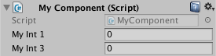
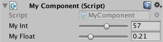
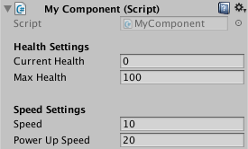
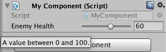
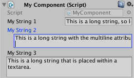

# 15 - Pimp the Inspector

When a script inheriting from *MonoBehaviour* is attached to a *GameObject*, detailed information about that GameObject's properties are displayed in the inspector window. If the GameObject has a lot of properties, the inspector can seem cluttered, making it difficult to find specific properties. Moreover, when the script writer isn't the person actually viewing the inspector, it would be good to display additional information and verify input when possible. Luckily there are a number of attributes which can help us achieve this.

## SerializeField, HideInInspector

When a public, serializable property is declared in a script, it is by default serialized and exposed to the inspector. A serialized property can be hidden from the inspector with **[HideInInspector]** attribute, while a private variable can be serialized and exposed to the inspector with the **[SerializeField]** attribute.

```C#
public class MyComponent : MonoBehaviour
{
  //serialized and exposed to the inspector by default, accessible by all objects with a reference of this instance
  public int myInt1;
  //serialized but not exposed to the inspector, accessible by all objects with a reference of this instance
  [HideInInspector] public int myInt2;
  //serialized and exposed to the inspector, not publicly accessible
  [SerializeField] private int myInt3;
}
```



Although Unity state that *"you will almost never need [SerializeField]"*, the **[SerializeField] private** combination is often used to adhere to encapsulation while serializing private variables. **[HideInInspector]** is very useful to hide serialized class members which don't need to be edited in the inspector.

## RequireComponent

The **[RequireComponent]** attribute automatically adds required components as dependencies - when a script which uses this attribute is added to a GameObject, the required component will automatically be added to the GameObject. One example is *UI/Button* which automatically adds *UI/Image*, a required dependency. Consider the practical example of including a *Rigidbody2D* for a PlayerMove script:

```C#
[RequireComponent(typeof(Rigidbody2D))]
public class PlayerMove : MonoBehaviour
{
}
```

Note that **[RequireComponent]** only checks for missing dependencies when the component is added to a GameObject - existing instances which lack new dependencies will not have those dependencies automatically added. Thus this attribute is useful in insuring that the initial setup is correct.

## RangeAttribute

The **[Range]** attribute is especially useful when an int or float should be constrained to a certain range. Not only does it force all input to be valid, but it supplies an intuitive method of quickly testing values values in play mode.

```C#
public class MyComponent : MonoBehaviour
{
  [Range(0, 100)] [SerializeField] private int myInt;
  [Range(0, 1)] [SerializeField] private float myFloat;
}
```



## HeaderAttribute, SpaceAttribute

The **[Header]** attribute adds a header above properties, while the **[Space]** attribute adds a vertical space between successive properties in the inspector, both of which are great ways of visually breaking the component's block of properties into various groups.

```C#
public class MyComponent : MonoBehaviour
{
  [Header("Health Settings")]
  [SerializeField] private int currentHealth = 0;
  [SerializeField] private  int maxHealth = 100;
  [Space(10)]
  [Header("Speed Settings")]
  [SerializeField] private float speed = 10;
  [SerializeField] private int powerUpSpeed = 20;
}
```



## ToolTipAttribute

By default, the inspector displays property names as capitalized words. Although descriptive names should give a good idea about what a property does, additional information can be very useful for teammates who simply assign values to properties via the inspector without any familiarity with the script itself (i.e. Level Designer, UI Artist). The **[ToolTip]** attribute adds a tooltip when the mouse curser hovers over the property.

```C#
public class MyComponent : MonoBehaviour
{
  [Tooltip("The enemy's health, a value between 0 and 100.")]
  [Range(0, 100)] [SerializeField] private int enemyHealth = 0;
}
```



## TextAreaAttribute, MultilineAttribute

By default a string that is too long to be rendered inside the inspector window will be cut off. For long, editable strings that need to be displayed in the inspector, one approach is to use a **[TextArea]** which automatically wraps a string within an assignable height rectangle - if the string is too long, a scrollbar appears. **MultilineAttribute** allows a string to be edited in a multiline textfield, however doesn't automatically wrap the string.

```C#
public class MyComponent : MonoBehaviour
{
  [SerializeField] private string myString1 = "This is a long string, so long that it cannot fit within the inspector window.";
  [Multiline(2)] [SerializeField] private string myString2 = "This is a long string with the multiline attribute that still doesn't fit inside the inspector.";
  [TextArea] [SerializeField] private string myString3 = "This is a long string that is placed within a TextArea.";
}
```



## HelpURLAttribute

The **[HelpURLAttribute]** attribute provides a custom reference link which is triggered once the help **(?)** icon is clicked in the inspector (see any of the images above).

```C#
[HelpURL("http://example.com/docs/MyComponent.html")]
public class MyComponent : MonoBehaviour
{
}
```

## Conclusion

Today we have seen some quick yet powerful approaches in making a component's inspector window display relevant information in a tidy and intuitive manner. Over the next few tips I will be discussing how editor scripting can be immensely useful in building tools for the developer and their fellow teammates.

## Further Reading

[Manual - The Inspector window](https://docs.unity3d.com/Manual/UsingTheInspector.html)

[Scripting API - SerializeField](https://docs.unity3d.com/ScriptReference/SerializeField.html)

[Scripting API - HideInInspector](https://docs.unity3d.com/ScriptReference/HideInInspector.html)

[Scripting API - RequireComponent](https://docs.unity3d.com/ScriptReference/RequireComponent.html)

[Scripting API - RangeAttribute](https://docs.unity3d.com/ScriptReference/RangeAttribute.html)

[Scripting API - HeaderAttribute](https://docs.unity3d.com/ScriptReference/HeaderAttribute.html)

[Scripting API - SpaceAttribute](https://docs.unity3d.com/ScriptReference/SpaceAttribute.html)

[Scripting API - TextAreaAttribute](https://docs.unity3d.com/ScriptReference/TextAreaAttribute.html)

[Scripting API - MultilineAttribute](https://docs.unity3d.com/ScriptReference/MultilineAttribute.html)

[Scripting API - HelpURLAttribute](https://docs.unity3d.com/ScriptReference/HelpURLAttribute.html)
