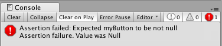

# 16 - OnValidate

Yesterday we talked about the **[Range]** attribute which ensures that float/int values entered in the inspector are constrained to a certain range, thus ensuring valid input. However wouldn't it be great to validate data for all properties, not just those of type float and int?

**OnValidate** is a callback when a script extending *MonoBehaviour* or *ScriptableObject* (not mentioned in the API) is loaded or the value of a property is changed in the inspector. Here we can use if statements or assertions to check that the inputted data is valid.

```C#
public class MyComponent : MonoBehaviour
{
  [SerializeField] private Button myButton;

  private void OnValidate()
  {
    Assert.IsNotNull(myButton, "Expected myButton to be not null");
  }
}
```




## Further Reading

[Scripting API - MonoBehaviour.OnValidate()](https://docs.unity3d.com/ScriptReference/MonoBehaviour.OnValidate.html)

[Scripting API - Assertions.Assert](https://docs.unity3d.com/ScriptReference/Assertions.Assert.html)
