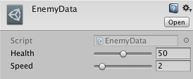
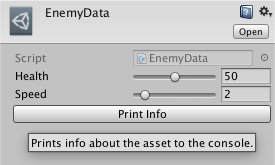
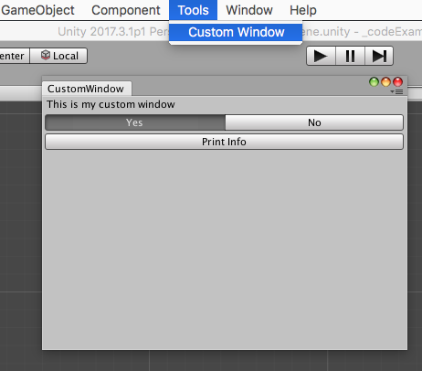

# 17 - Custom Editor Windows

One of the most powerful features of the Unity editor is the ability to create custom windows and inspectors. We have already seen how we can use attributes such as **[Range]**, **[ToolTip]**, **[HideInInspector]**, **[HeaderAttribute]** etc. to customize a component's inspector. However, by writing a custom editor script for a component or asset, we can define exactly how the inspector should look, include useful buttons, visual the data etc.

## Custom Inspector

One very simple but useful addition to an inspector is a button which can display information about the object, import assets from a folder or toggle pre-defined settings. Consider the following *EnemyData* scriptable object.

```C#
using UnityEngine;

/// <summary>An asset used to store data for an enemy.</summary>
[CreateAssetMenu(fileName = "EnemyData", menuName = "EnemyData", order = 1000)]
public class EnemyData : ScriptableObject
{
  /// <summary>The enemy's health.</summary>
  [Tooltip("The enemy's health.")]
  [Range(0, 100)] public int health;
  /// <summary>The enemy's speed.</summary>
  [Tooltip("The enemy's speed.")]
  [Range(1, 10)] public float speed;

  /// <summary>Returns a string representation of the object.</summary>
  public override string ToString()
  {
    return string.Format("[EnemyData {0}: health={1}, speed={2}]", name, health, speed);
  }
}
```

By default the editor renders the following inspector for this asset:



By writing a script extending from *Editor* and overriding the callback **OnInspectorGUI**, we have complete control over the inspector's layout. These Editor scripts must be placed in the root or a subdirectory of folder named ```Editor```, generally ```Assets/Editor``` but ```Assets/Imported/DeFuncArt/Editor/Utilities/``` would also be valid.

```C#
#if UNITY_EDITOR
using UnityEditor;
using UnityEngine;

/// <summary>A custom editor script for the EnemyData asset.</summary>
[CustomEditor(typeof(EnemyData))]
public class EnemyDataEditor : Editor
{
  /// <summary>Callback to draw the inspector.</summary>
  public override void OnInspectorGUI()
  {
    //get a reference to the target script
    EnemyData targetScript = (EnemyData)target;
    //draw default inspector for asset's properties
    DrawDefaultInspector();
    //draw a button which prints info to the console
    if(GUILayout.Button(new GUIContent(text: "Print Info", tooltip: "Prints info about the asset to the console.")))
    {
      Debug.Log(targetScript.ToString());
    }
  }
}
#endif
```

*DrawDefaultInspector* draws the same, default inspector that we saw above. However, underneath we draw a button, which if pressed, prints debug info to the console:



This example may be quite trivial, however you can see the potential, for instance triggering an import method in EnemyData which imports from XLS file, or a LevelManager which imports an array of LevelData assets from a predefined path.

## Custom Window

We can also easily create custom windows in the editor by writing a script extending from *EditorWindow* and customizing **OnGUI**.

```C#
#if UNITY_EDITOR
using UnityEditor;
using UnityEngine;

/// <summary>An EditorWindow to automate the creation of game data assets.</summary>
class CustomWindow : EditorWindow
{
  /// <summary>The current selected option.</summary>
  public static int option = 0;
  /// <summary>An array of strings used as toolbar texts.</summary>
  public static string[] optionNames = { "Yes", "No" };

  //add a menu item named "Import Assets" to the Tools menu (shortcut ALT-CMD-B)
  [MenuItem("Tools/Custom Window")]
  public static void ShowWindow()
  {
    //show existing window instance - if one doesn't exist, create one
    EditorWindow.GetWindow(typeof(CustomWindow));
  }

  /// <summary>Draws the window.</summary>
  private void OnGUI()
  {
    //draw a label
    GUILayout.Label("This is my custom window");
    //draw a toolbar (array of buttons) and assign the selected button index as option
    option = GUILayout.Toolbar (option, optionNames);
    //draw a button which, if triggered, prints info to the console
    if(GUILayout.Button("Print Info")) { PrintToConsole(); }
  }

  /// <summary>Prints to console.</summary>
  private void PrintToConsole()
  {
    Debug.Log("Hello, World!");
  }
}
#endif
```



## Conclusion

Custom inspectors and custom windows are quite powerful and can help not only your workflow, but that of your team. For more info, check google and the gazillion tutorials or start here with this [official one](https://unity3d.com/learn/tutorials/topics/interface-essentials/building-custom-inspector).

## Further Reading

[Manual - Extending the Editor](https://docs.unity3d.com/Manual/ExtendingTheEditor.html)

[Scripting API - Editor](https://docs.unity3d.com/ScriptReference/Editor.html)

[Scripting API - Editor.OnInspectorGUI](https://docs.unity3d.com/ScriptReference/Editor.OnInspectorGUI.html)

[Scripting API - EditorWindow](https://docs.unity3d.com/ScriptReference/EditorWindow.html)

[Scripting API - EditorWindow.OnGUI](https://docs.unity3d.com/ScriptReference/EditorWindow.OnGUI.html)
