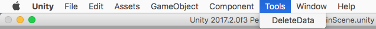
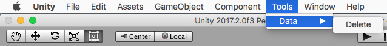
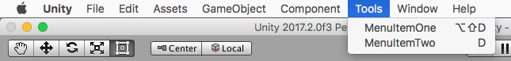

# 18 - Custom Menu Items

The Unity editor allows adding custom menus which look and behave like built-in menus. This can be especially useful for adding commonly used functionality used throughout a project, for instance opening a scene in the editor, resetting all game data or triggering cheats to test gameplay etc.

## Adding Custom Menu Items

To add a custom menu item, we simply need to create an editor script and write a static method marked with the **MenuItem** attribute.

```C#
#if UNITY_EDITOR
using UnityEditor;
using UnityEngine;

public class CustomMenus
{
  [MenuItem("Tools/DeleteData")]
  public static void DeleteData()
  {
    PlayerPrefs.DeleteAll();
  }
}
#endif
```

This creates a new editor menu *Tools* with the menu item *DeleteData*:



It is also possible to create new menu items under existing menus (i.e. Window), and also to create multiple levels of menus for better structuring and organization:

```C#
[MenuItem("Tools/Data/Delete")]
```



## Hotkey shortcuts

New menu items can be assigned hotkeys combinations that will automatically launch them.

<table>
  <tr>
    <td><b>Hotkey</b></td>
    <td><b>Description</b></td>
  </tr>
  <tr>
    <td>%</td>
    <td>CTRL on windows, CMD on Mac</td>
  </tr>
  <tr>
    <td>#</td>
    <td>Shift</td>
  </tr>
  <tr>
    <td>&amp</td>
    <td>Alt</td>
  </tr>
  <tr>
    <td>#LEFT, #RIGHT, #UP, #DOWN<br>#HOME, #END, #PGUP, #PGDN</td>
    <td>Navigation keys</td>
  </tr>
  <tr>
    <td>#F1 ... #F12</td>
    <td>Function keys</td>
  </tr>
</table>

Hotkey character combinations are added to the end of the menu item path, preceded by a space. Character keys not part of a key-sequence are added by adding an underscore prefix to them (i.e. _d for shortcut key “D”).

```C#
#if UNITY_EDITOR
using UnityEditor;
using UnityEngine;

public class CustomMenus
{
  ///<summary>A menu item with hotkey ALT-SHIFT-D</summary>
  [MenuItem("Tools/MenuItemOne #&d")]
  public static void MenuItemOne() {}

  ///<summary>A menu item with hotkey D</summary>
  [MenuItem("Tools/MenuItemTwo _d")]
  public static void MenuItemTwo() {}
}
#endif
```

Menu items with hotkeys will display the key-combination that is used to launch them.



## Open Scenes in the Editor

As opposed to searching in the [Project Window](https://docs.unity3d.com/Manual/ProjectView.html), one instance where I especially like to use custom hotkey menu items is for opening scenes in the editor. This can be easily achieved by using the scene's build index and a hot key combination, for instance ALT-SHIFT-0, and the *EditorSceneManager*.

```C#
#if UNITY_EDITOR
using UnityEditor;
using UnityEditor.SceneManagement;
using UnityEngine;

public class CustomMenus
{
  /// <summary>Opens the scene with build index 0 using a menu item or hotkey SHIFT-ALT-0.</summary>
  [MenuItem("Tools/Open Scene/Scene0 #&0")]
  public static void OpenScene0()
  {
    EditorSceneManager.OpenScene("Assets/Scenes/Scene0.unity");
  }
}
#endif
```

## Further Reading

[Unity Editor Extensions – Menu Items](https://unity3d.com/learn/tutorials/topics/interface-essentials/unity-editor-extensions-menu-items)

[Scripting Reference - MenuItem](https://docs.unity3d.com/ScriptReference/MenuItem.html)

[Scripting Reference - EditorSceneManager](https://docs.unity3d.com/ScriptReference/SceneManagement.EditorSceneManager.html)
