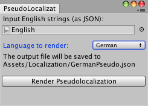

# 23 - Pseudolocalization

*Internationalization* is the process of designing a software application so that it can easily be adapted to various other languages and regions without any programming changes. *Localization* is the process of adapting internationalized software for a specific region or language by adding locale-specific components (€2.99 => 2,99€) and translating text (Hello World! => Hallo Welt!). *Pseudolocalization* is a software testing method used before the localization process in which a fake (or pseudo) translations (with the region and language specific characters) are generated: Hello World! => Hellö Wörld!|ÜüäßÖ

The benefits of pseudolocalization are three fold:

1. To test that all (special) characters of the target locale (i.e. German) are displayed correctly.
2. To test that text boxes can accommodate longer translations. If a pseduotranslation is cutoff or visually looks ugly on the screen, then there's a good chance that the real translation will also be.
3. To flag hardcoded strings or non-localized art.

## Text Expansion

Considering English as the base language, after translation many languages will exhibit *Text Expansion* and have longer text strings. Generally German extends by 10-35%, Polish 20-30% and Russian by 15%. As a quick rule of thumb, I like to utilize IGDA Localization SIG's suggestions:

| English Text Length | Pseduotranslation Length |
| :-------------------|:-------------------------|
| 1-10 characters     | 150%                     |
| 10-20 characters    | 140%                     |
| >20 characters      | 130%                     |

**Note:** some languages can actually have shorter text strings. In this post I will be considering languages that generally expand.

## Pseudo text

From various examples I have seen on the web, there are many different ways to visualize these pseudo texts. Personally I prefer to generate separate pseudolocalizations for each target localization and test them separately to ensure that each target localization will be adequately rendered. My pseduotranslation style starts with the English text, replaces any Basic Latin characters (i.e. English letters) with similar special characters, uses pipe **|** as a divider, and then adds a few random characters at the end (depending on original text size.) So *Hello World!* becomes:

| English | Hello World!            |
| :-------|:------------------------|
| German  | Hellö Wörld!&#124;ÜüäßÖ |
| Polish  | Hęłłó Wórłd!&#124;ꜿʌ |
| Russian | Нёлло Шоялд!&#124;ОТЧжт |

It is important to remember that this pseduotranslation is non-sensical: it is not a real translation, instead merely a way to test that the game is ready for the translation stage.

## Unity Helper

A pseudolocalization generator can easily be coded in Unity to enable quick testing.



This EditorWindow is given a JSON TextAsset reference (assumed to be English) of the form

```
{ "items" : [
{ "key": "hello", "value": "Hello World!"},
{ "key": "test", "value": "The quick brown fox jumps over the lazy dog."}
]}
```
and saves, for instance, *GermanPseudo.json* to the save directory as the original file:

```
{"items":[
{ "key": "hello", "value": "Hellö Wörld!|ßüüÜß"},
{ "key": "test", "value": "The qüick bröwn föx jümpß över the lazy dög.|ÄßÖüÜüÜÜÖÜüäää"}
]}
```

This JSON is read from and written to disk using the [*JSON Serialization*](https://github.com/defuncart/50-unity-tips/tree/master/%2309-JSONSerialization) mentioned back in Tip #9.

## Other Languages

This approach could be easily extended to other Latin script languages, for instance:

| Language | Special Characters             |
| :--------|:-------------------------------|
| French   | àâæéèêëîïôœùûüçÀÂÆÉÈÊËÎÏÔŒÙÛÜÇ |
| Czech    | áčďéěíňóřšťúůýžÁČĎÉĚÍŇÓŘŠŤÚŮÝŽ |
| Spanish  | áéíóúüñÁÉÍÓÚÜÑ¿¡               |

I don't have any experience with languages that contract (when translated to from English) or languages that are written right-to-left, but I imagine a similar approach to Russian would work perfectly fine.

## Conclusion

The earlier that localization issues are flagged, the less time required and more cost effective the solution will be. By investing a small amount of time in generating pseudotranslations and verifying that the game is ready for localization, one can be assured that everything is in order before actually beginning the localization phase.

## Further Reading

[50 Unity Tips - JSON Serialization](https://github.com/defuncart/50-unity-tips/tree/master/%2309-JSONSerialization)

[Pseudo-Localization – A Must in Video Gaming](http://www.gamasutra.com/blogs/IGDALocalizationSIG/20180504/317560/PseudoLocalization__A_Must_in_Video_Gaming.php)

[Localization - Expansion and contraction factors](https://www.andiamo.co.uk/resources/expansion-and-contraction-factors)

[What is Pseudo-Localization?](http://blog.globalizationpartners.com/what-is-pseudo-localization.aspx)
