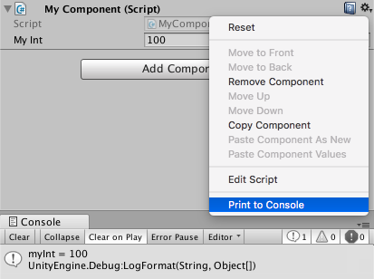
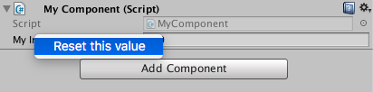

# 24 - Context Menus

In **#17-CustomEditorWindows** we discussed how we could create a *custom editor* displaying a button that once pressed, executes a function within the component's script. Personally I like the simplicity of a button inside the inspector, however if one only needs to execute a function from the editor, then writing a custom editor for the component is overkill. One alternative is to use the component's context menu.

## Context Menu

When we click on the gear icon in the top-right corner of a component, we are present with a dropdown menu of options where the component can be copied, pasted, pasted as new etc. By using the **[ContextMenu]** attribute, we can add commands to this menu.

```c#
public class MyComponent : MonoBehaviour
{
    [SerializeField] private int myInt = 100;

    [ContextMenu("Print to Console")]
    public void PrintToConsole()
    {
        Debug.LogFormat("myInt = {0}", myInt);
    }
}
```

Now when we select the component's context menu, the option *Print to Console* will be available, while clicking on this option will execute the associated function. Note that this function must be non-static.



## Context Menu Item

Another approach is to add a context menu direct to a property field by using the **ContextMenuItemAttribute** to execute a named function.

```c#
public class MyComponent : MonoBehaviour
{
    [ContextMenuItem(name: "Reset this value", function: "Reset")]
    [SerializeField] private int myInt = 100;
    public void Reset()
    {
        myInt = 0;
    }
}
```

Now when we right-click on the property, we are presented with the option to execute the custom command.



## Conclusion

*Context Menus* are one approach when one needs to execute a method from the editor without resorting to write a custom editor. Although they are quite useful, they aren't as visible as a GUI button and the end user would need to be notified that they actually exist.

## Further Reading

[50 Unity Tips - #15 Pimp the Inspector](https://github.com/defuncart/50-unity-tips/tree/master/%2315-PimpTheInspector)

[50 Unity Tips - #17 Custom Editor](https://github.com/defuncart/50-unity-tips/tree/master/%2317-CustomEditor)

[API - ContextMenu](https://docs.unity3d.com/ScriptReference/ContextMenu.html)

[API - ContextMenuItemAttribute](https://docs.unity3d.com/ScriptReference/ContextMenuItemAttribute.html)
