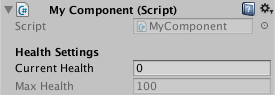

# 25 - Property Drawers

*Property Drawers* are used to customize the look of certain controls in the Inspector window or the look of a Serializable class itself. Unlike *Custom Editors* which customize a single MonoBehavior or ScriptableObject, *Property Drawers* customize the look of every instance of the Serializable class. Moreover, by using custom *PropertyAttributes*, the look of all class properties with a specified attribute can be easily customized.

## Serializable Class

The look of a Serializable class can be customized by writing a *Property Drawer*. Although this may seem identical to **#17-CustomEditor** where we customized how the EnemyData SerializedObject appeared in the inspector, there is a major difference: *Custom Editors* are used to draw a UnityEngine.Object class in full while *Property Drawers* are used to draw a nested class or struct inside a UnityEngine.Object.

For more information check out the [Unity Manual](https://docs.unity3d.com/Manual/editor-PropertyDrawers.html) and this [forum post](https://forum.unity.com/threads/when-to-choose-a-custom-editor-vs-property-drawer.333306/#post-2302232).

## Custom Attributes

In **#15-PimpTheInspector** we discussed the **[HideInInspector]**, **[Range]** and **[TextArea]** attributes which hide properties from the inspector, displayed a min/max slide for properties or display properties as a text box, all examples of built-in property drawers. In fact, we can define our own custom *PropertyAttributes* and state how they should draw associated properties in the inspector.

Presently we can hide properties using **[HideInInspector]**, however what if we want to expose a property to the inspector but have it non-editable? As this is something that could be used throughout multiple classes and projects, one approach is to define a custom property attribute.

Firstly we define the property attribute itself:

```c#
/// <summary>An attribute to make a property non-editable (i.e. read only) in the inspector.</summary>
public sealed class ReadOnlyAttribute : PropertyAttribute {}
```

and then define how the property attribute should be drawn:

```c#
/// <summary>A custom property drawer for the ReadOnly attribute.</summary>
[CustomPropertyDrawer(typeof(ReadOnlyAttribute))]
public class ReadOnlyAttributeDrawer : PropertyDrawer
{
    /// <summary>Callback to make a custom GUI for the property.</summary>
    /// <param name="position">Rectangle on the screen to use for the property GUI..</param>
    /// <param name="property">The SerializedProperty to make the custom GUI for..</param>
    /// <param name="label">The label of this property..</param>
    public override void OnGUI(Rect position, SerializedProperty property, GUIContent label)
    {
        GUI.enabled = false;
        EditorGUI.PropertyField(position, property, label, true);
        GUI.enabled = true;
    }

    /// <summary>Callback to specify how tall the GUI for this field in pixels is. Default is 1 line high.</summary>
    /// <returns>The height in pixels.</returns>
    /// <param name="property">The SerializedProperty to make the custom GUI for..</param>
    /// <param name="label">The label of this property..</param>
    public override float GetPropertyHeight(SerializedProperty property, GUIContent label)
    {
        return EditorGUI.GetPropertyHeight(property, label, true);
    }
}
```

This property attribute can then be easily used as follows:

```c#
public class MyComponent : MonoBehaviour
{
    [Header("Health Settings")]
    [SerializeField] private int currentHealth = 0;
    [ReadOnly, SerializeField] private int maxHealth = 100;
}
```



Custom property attributes are a very powerful feature. To see their potential, take a look at [this list](https://fishtopher.github.io/UnityDrawers/) of open-source property drawers.

## Conclusion

By using *Property Drawers* we can customize how classes or properties are drawn in the inspector. As *Property Drawers* customize the look of all instances of a class/all properties with a specified attribute, they can easily be re-used throughout multiple classes and projects, thus potentially limiting the number of *Custom Editors* that need to be written.

## Further Reading

[50 Unity Tips - #15 Pimp the Inspector](https://github.com/defuncart/50-unity-tips/tree/master/%2315-PimpTheInspector)

[50 Unity Tips - #17 Custom Editor](https://github.com/defuncart/50-unity-tips/tree/master/%2317-CustomEditor)

[Forums - When to choose a custom editor vs. property drawer](https://forum.unity.com/threads/when-to-choose-a-custom-editor-vs-property-drawer.333306/)

[API - PropertyAttribute](https://docs.unity3d.com/ScriptReference/PropertyAttribute.html)

[API - PropertyDrawer](https://docs.unity3d.com/ScriptReference/PropertyDrawer.html)

[Manual - PropertyDrawers](https://docs.unity3d.com/Manual/editor-PropertyDrawers.html)

[Unity Drawers](https://fishtopher.github.io/UnityDrawers/)
