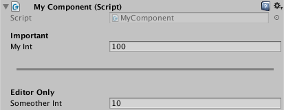

# 26 - Decorator Drawers

A *DecoratorDrawer* is similar to a *PropertyDrawer*, except that it doesn't draw a property but rather a decorative element based on a *PropertyAttribute*. Unlike property drawers, a decorator drawer isn't associated with property fields, however it still needs to be placed above a field. Another difference is that there can be multiple *DecoratorDrawer* attributes above the same field. Also, unlike property drawers, if a *DecoratorDrawer* attribute is placed above a List or an array property field, the decorator will only show up once before the array and not for every array element.

In **#15-PimpTheInspector** we discussed the **[Header]**, **[Space]**, **[ToolTip]** attributes which are examples of built-in decorator drawers. In fact, we can define our own custom *PropertyAttributes* and state how they should be draw in the inspector by extending the **DecoratorDrawer** class.

## Color Line

Lets say that we'd like to draw a line with a given width, height, vertical padding and color to visually separate parts of the inspector. Firstly we define the custom property attribute:

```c#
/// <summary>A decorative attribute to draw a colored line in the inspector.</summary>
public sealed class ColorLineAttribute : PropertyAttribute
{
    /// <summary>The default width.</summary>
    private const float DEFAULT_WIDTH = 0.5f;
    /// <summary>The default height.</summary>
    private const float DEFAULT_HEIGHT = 3f;
    /// <summary>The default padding.</summary>
    private const float DEFAULT_PADDING = 5f;

    /// <summary>The line's width. This can either be a fixed value (i.e. 100) or relative to the inspector's width (i.e. 0.9).</summary>
    public float width { get; private set; }
    /// <summary>The line's height. This can either be a fixed value (i.e. 3) or relative to the inspector's width (i.e. 0.05).</summary>
    public float height { get; private set; }
    /// <summary>The vertical padding around the line. This can either be a fixed value (i.e. 5) or relative to the inspector's width (i.e. 0.1).</summary>
    public float padding { get; private set; }
    /// <summary>The line's color.</summary>
    public Color color { get; private set; }

    /// <summary>The attribute's constructor.</summary>
    /// <param name="width">The width.</param>
    /// <param name="height">The height.</param>
    /// <param name="padding">The padding.</param>
    /// <param name="r">The red value (between 0 and 1).</param>
    /// <param name="g">The green value (between 0 and 1).</param>
    /// <param name="b">The blue value (between 0 and 1).</param>
    public ColorLineAttribute(float width=DEFAULT_WIDTH, float height=DEFAULT_HEIGHT, float padding=DEFAULT_PADDING, float r=1f, float g=0f, float b=0f)
    {
        this.width = width > 0 ? width : DEFAULT_WIDTH;
        this.height = height > 0 ? height : DEFAULT_HEIGHT;
        this.padding = padding > 0 ? padding : DEFAULT_PADDING;
        color = (r >= 0 && r <= 1 && g >= 0 && g <= 1 && b >= 0 && b <= 1 ? new Color(r, g, b) : Color.red);
    }
}
```

and then define how this property attribute should be drawn:

```c#
/// <summary>A custom property drawer for the ColorLine attribute.</summary>
[CustomPropertyDrawer(typeof(ColorLineAttribute))]
public class ColorLineAttributeDrawer : DecoratorDrawer
{
    /// <summary>The ColorLine attribute.</summary>
    private ColorLineAttribute colorLine
    {
        get { return (ColorLineAttribute)attribute; }
    }

    /// <summary>The line's vertical padding.</summary>
    private float padding
    {
        get { return colorLine.padding > 1 ? colorLine.padding : colorLine.padding*Screen.height; }
    }

    /// <summary>Callback to specify how tall the GUI for this decorator in pixels is. Default is 1 line high.</summary>
    /// <returns>The height in pixels.</returns>
    public override float GetHeight()
    {
        return base.GetHeight() + 2*padding;
    }

    /// <summary>Callback to make a custom GUI for this decorator.</summary>
    /// <param name="position">Rectangle on the screen to use for the decorator GUI.</param>
    public override void OnGUI(Rect position)
    {
        //firstly calculate the line's width and height (either fixed or proportional)
        float width = colorLine.width > 1 ? colorLine.width : colorLine.width*Screen.width;
        float height = colorLine.height > 1 ? colorLine.height : colorLine.height*Screen.height;

        //next calculate the line's start x, y positions
        float x = (position.x + (position.width / 2)) - width / 2;
        float y = position.y + padding + height / 2;

        //finally draw the line (by using the built in white pixel texture, tinted with GUI.color)
        Color currentGUIColor = GUI.color; //make a reference to the current color
        GUI.color = colorLine.color;
        EditorGUI.DrawPreviewTexture(new Rect(x, y, width, height), Texture2D.whiteTexture);
        GUI.color = currentGUIColor; //reset
    }
}
```

This property attribute can then be easily used as follows:

```c#
public class MyComponent : MonoBehaviour
{
    [Header("Important")]
    [SerializeField] private int myInt = 100;

    [Space(15)]
    [ColorLine(width: 0.9f, height: 3, padding: 5, r: 0.5f, g: 0.5f, b: 0.5f)]

    [Header("Editor Only")]
    [SerializeField] private int someotherInt = 10;
}
```



## Conclusion

By using *DecoratorDrawer* attributes, we can customize how decorative elements are drawn in the inspector. These decorative elements are a quick and easy approach to visually organizing the inspector without having to define a *CustomEditor*.

## Further Reading

[50 Unity Tips - #15 Pimp the Inspector](https://github.com/defuncart/50-unity-tips/tree/master/%2315-PimpTheInspector)

[50 Unity Tips - #25 Property Drawers](https://github.com/defuncart/50-unity-tips/tree/master/%2325-PropertyDrawers)

[API - DecoratorDrawer](https://docs.unity3d.com/ScriptReference/DecoratorDrawer.html)

[API - PropertyAttribute](https://docs.unity3d.com/ScriptReference/PropertyAttribute.html)

[API - PropertyDrawer](https://docs.unity3d.com/ScriptReference/PropertyDrawer.html)
