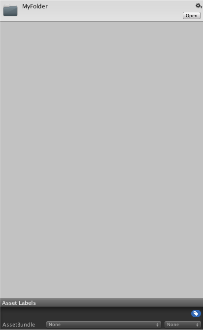
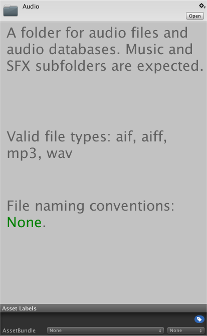
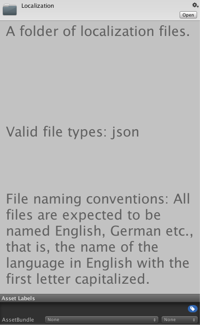

# 27 - Custom Folder Inspectors

By default, folders are rendered blank (left image) in the inspector. Wouldn't it be much better if we could customize these inspectors somehow, for instance, adding a short description, valid file types or file naming conventions (right image)? Not only could this be beneficial for future you, but also for your current teammates!

<table style="width:100%">
  <tr>
    <th></th>
    <th></th>
  </tr>
</table>

Just like any other asset, folders are imported into Unity, however they don't have any specific type and are assigned as *DefaultAssets*. By defining a custom editor, we can customize how this asset will appear in the inspector.

```c#
/// <summary>Custom Editor for the DefaultAsset.</summary>
[CustomEditor(typeof(DefaultAsset), true)]
public class DefaultAssetEditor : Editor
{
    /// <summary>Callback to draw the inspector.</summary>
    public override void OnInspectorGUI()
    {
        //draw the default inspector
        DrawDefaultInspector();

        //get the asset's path
        string assetPath = AssetDatabase.GetAssetPath(target);

        //if the asset is a folder
        if(Directory.Exists(assetPath))
        {
            //add custom code
        }
    }
}
```

## Folder Descriptions

One approach to adding folder descriptions, is to create a static class with a simple dictionary.

```c#
/// <summary>A class of folder options.</summary>
public class DAFolderAsset
{
    /// <summary>A class which contains folder descriptions for given folder paths.</summary>
    public static class Descriptions
    {
        /// <summary>A placeholder stating that no explicit description was given.</summary>
        public const string PLACEHOLDER = "<color=red>No</color> description given.";

        /// <summary>A dictionary of folder paths and descriptions.</summary>
        private static Dictionary<string, string> dict = new Dictionary<string, string>
        {
            { "Assets/Audio", "A folder for audio files and audio databases. Music and SFX subfolders are expected." },
            { "Assets/Editor", "A folder for custom editor scripts and color palettes." },
            { "Assets/Fonts", "A folder for fonts." },
            { "Assets/Prefabs", "A folder for prefabs." },
            { "Assets/Scenes", "A folder for scenes." },
            { "Assets/Scripts", "A folder for scripts." },
            { "Assets/Sprites", "A folder for sprites." }
        };

        /// <summary>Returns a description for a given folder path.</summary>
        /// <param name="folder">The folder path.</param>
        public static string DescriptionForFolder(string folder)
        {
            return dict.ContainsKey(folder) ? dict[folder] : PLACEHOLDER;
        }
    }
```

Some folders are common between multiple projects, while others may be unique to the current project. As a static class cannot be abstract or inherited from, one simple approach to add additional descriptions is to include a method in **DAFolderAsset.Descriptions**

```c#
/// <summary>Adds a param list of folder path, folder descriptions key-value pairs.</summary>
/// <param name="kvps">The key-value pairs.</param>
public static void AddFolderDescriptions(params KeyValuePair<string, string>[] kvps)
{
    foreach(KeyValuePair<string, string> kvp in kvps)
    {
        if(!dict.ContainsKey(kvp.Key)) { dict[kvp.Key] = kvp.Value; }
    }
}
```

and create a project-only script with a custom static method to add these additional descriptions:

```c#
[InitializeOnLoad]
public class MyFolderDescriptions
{
    static MyFolderDescriptions()
    {
        DAFolderAsset.Descriptions.AddFolderDescriptions(
            new KeyValuePair<string, string>("Assets/Localization", "A folder of localization files.")
        );
    }
}
```

thus rendering a custom inspector for the folder only for the current project:



The same approach can be utilized for valid file types and file naming conventions:

```c#
/// <summary>A class which contains valid file types for given folder paths.</summary>
public static class FileTypes
{
    /// <summary>A dictionary of folder paths and valid filetypes.</summary>
    private static Dictionary<string, List<string>> dict = new Dictionary<string, List<string>>
    {
        { "Assets/Audio", new List<string>{ "aif", "aiff", "mp3", "wav" } },
        { "Assets/Editor", new List<string>{ "cs", "colors" } },
        { "Assets/Fonts", new List<string>{ "tff" } },
        { "Assets/Prefabs", new List<string>{ "prefab" } },
        { "Assets/Scenes", new List<string>{ "unity" } },
        { "Assets/Scripts", new List<string>{ "cs" } },
        { "Assets/Sprites", new List<string>{ "png", "jpg", "psd" } }
    };
}
```

## Enforce Valid File Types

If we wish to strictly enforce valid file types for certain folders, we can extend *AssetPostprocessor* to tap into the asset pipeline and verify that all imported and moved assets have valid types for their new folders. By comparing the asset's file type to what is valid for the directory, we can verify that the asset's type is correct. If not, an error message can be printed to the console, and the asset deleted, effectively reusing to import that asset into that folder. For moved assets, the asset can be moved back into it's original folder.

```c#
/// <summary>A custom asset postprocessor which verifies that assets are imported into/moved to valid folders.</summary>
public class DAFolderAssetPostprocessor : AssetPostprocessor
{
    /// <summary>Callback after the importing of assets has completed. This call can occur after a manual reimport, or any time an asset/folder of assets
    /// are moved to a new location in the Project View. All string arrays are filepaths relative to the Project's root Assets folder.</summary>
    /// <param name="importedAssets">The imported assets.</param>
    /// <param name="deletedAssets">The deleted assets.</param>
    /// <param name="movedAssets">The moved assets.</param>
    /// <param name="movedFromAssetPaths">The moved-from assets.</param>
    static void OnPostprocessAllAssets(string[] importedAssets, string[] deletedAssets, string[] movedAssets, string[] movedFromAssetPaths)
    {
        Assert.AreEqual(movedAssets.Length, movedFromAssetPaths.Length);

        //check that all imported assets were imported into a valid folder
        foreach(string assetPath in importedAssets)
        {
            if(File.Exists(assetPath)) //file as opposed to a directory
            {
                string folder = Path.GetDirectoryName(assetPath);
                List<string> fileTypes = DAFolderAsset.FileTypes.FileTypesForFolder(folder);
                if(fileTypes != null)
                {
                    string extension = Path.GetExtension(assetPath).Replace(".", "");
                    if(!fileTypes.Contains(extension))
                    {
                        Debug.LogErrorFormat("Asset <color=red>{0}</color> could not be imported into folder <color=blue>{1}</color> because <color=green>{2}</color> is an invalid filetype.", Path.GetFileName(assetPath), folder, extension);
                        AssetDatabase.DeleteAsset(assetPath);
                    }
                }
            }
        }
    }
}
```

Please see **DAFolderAssetPostprocessor.cs** for the full implementation.

## Conclusion

By drawing a custom inspector for folders, we can visually display useful information that may otherwise be regelated to a documentation pdf. Moreover, by enforcing strict valid file types for relevant folders, we can assume that folders will always contain the correct value types.

## Further Reading

[50 Unity Tips - #03 Rich Text](https://github.com/defuncart/50-unity-tips/tree/master/%2303-RichText)

[50 Unity Tips - #17 Custom Editor](https://github.com/defuncart/50-unity-tips/tree/master/%2317-CustomEditor)

[API - DefaultAsset](https://docs.unity3d.com/ScriptReference/DefaultAsset.html)
